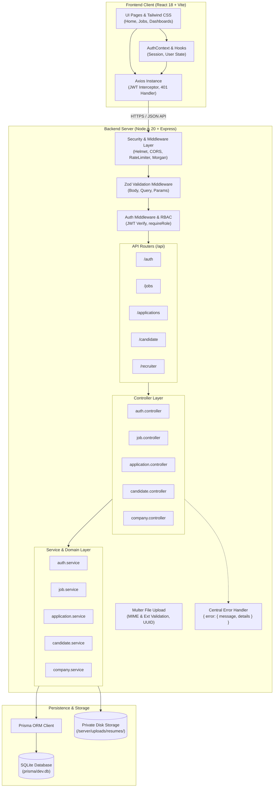

# HireLoop - System Architecture Diagram

This diagram displays the layered client-server architecture of the HireLoop monorepo.

```mermaid
flowchart TD
    subgraph Client["Frontend Client (React 18 + Vite)"]
        UI["UI Pages & Tailwind CSS\n(Home, Jobs, Dashboards)"]
        CTX["AuthContext & Hooks\n(Session, User State)"]
        AXIOS["Axios Instance\n(JWT Interceptor, 401 Handler)"]
        UI --> CTX
        UI --> AXIOS
        CTX --> AXIOS
    end

    subgraph Server["Backend Server (Node.js 20 + Express)"]
        SEC["Security & Middleware Layer\n(Helmet, CORS, RateLimiter, Morgan)"]
        AUTH_MW["Auth Middleware & RBAC\n(JWT Verify, requireRole)"]
        VAL_MW["Zod Validation Middleware\n(Body, Query, Params)"]
        MULTER["Multer File Upload\n(MIME & Ext Validation, UUID)"]

        subgraph Routes["API Routers (/api)"]
            R_AUTH["/auth"]
            R_JOBS["/jobs"]
            R_APP["/applications"]
            R_CAND["/candidate"]
            R_REC["/recruiter"]
        end

        subgraph Controllers["Controller Layer"]
            C_AUTH["auth.controller"]
            C_JOB["job.controller"]
            C_APP["application.controller"]
            C_CAND["candidate.controller"]
            C_COMP["company.controller"]
        end

        subgraph Services["Service & Domain Layer"]
            S_AUTH["auth.service"]
            S_JOB["job.service"]
            S_APP["application.service"]
            S_CAND["candidate.service"]
            S_COMP["company.service"]
        end

        ERR["Central Error Handler\n{ error: { message, details } }"]
    end

    subgraph Storage["Persistence & Storage"]
        PRISMA["Prisma ORM Client"]
        SQLITE[("SQLite Database\n(prisma/dev.db)")]
        DISK[("Private Disk Storage\n(/server/uploads/resumes/)")]
    end

    AXIOS -- "HTTPS / JSON API" --> SEC
    SEC --> VAL_MW
    VAL_MW --> AUTH_MW
    AUTH_MW --> Routes
    Routes --> Controllers
    Controllers --> Services
    Services --> PRISMA
    Services --> DISK
    PRISMA --> SQLITE
    Controllers -.-> ERR
```
